# Data Flow Mapping

## Overview

This document visualizes how data flows through the To-Do List application, from user interactions to database operations and API responses.

---

## System Architecture

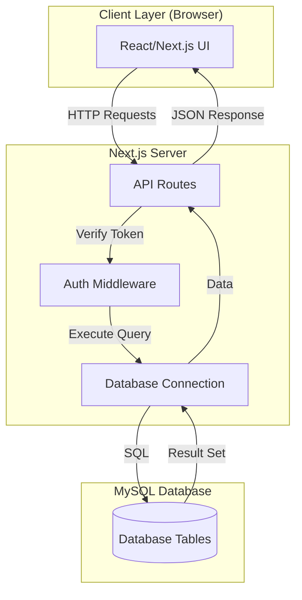

---

## User Authentication Flow

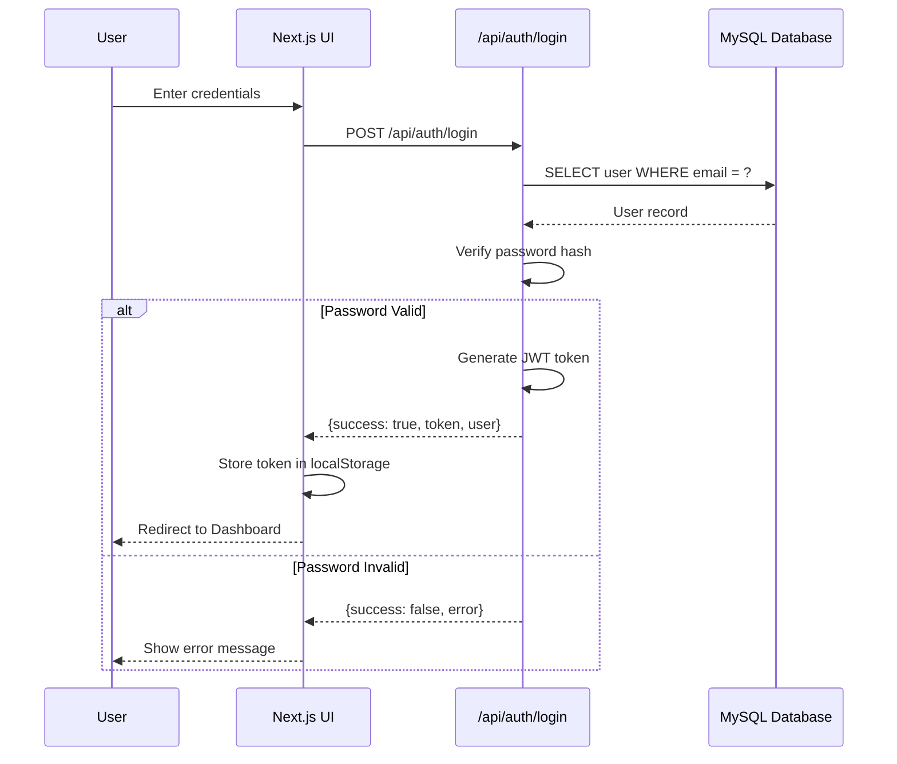

---

## User Registration Flow

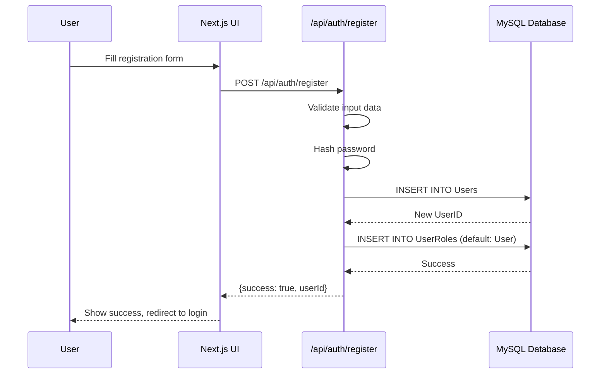

---

## Project Creation Flow

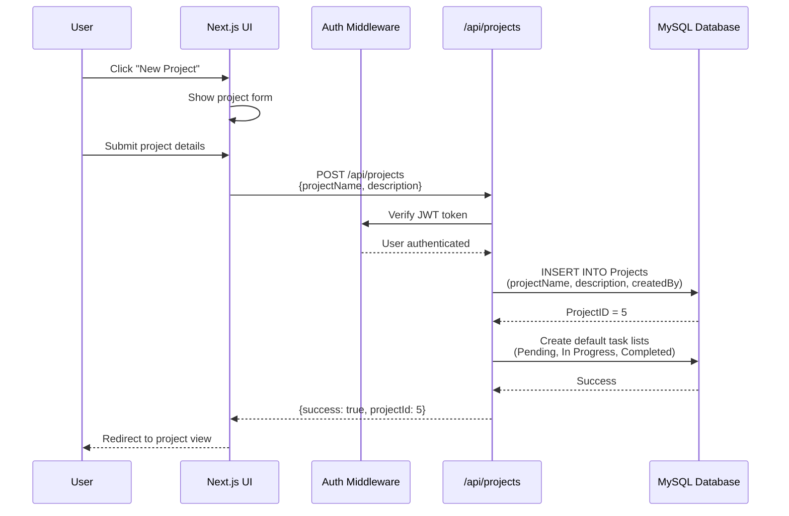

---

## Task Creation Flow

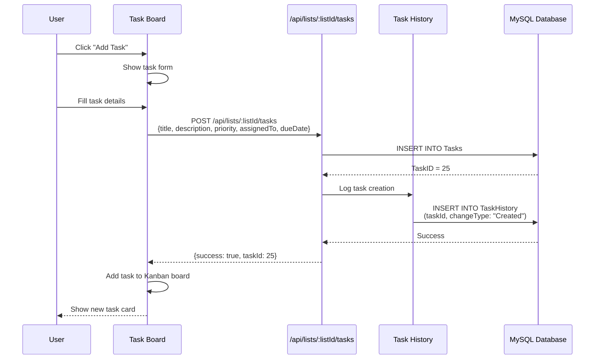

---

## Task Update Flow (Drag & Drop)

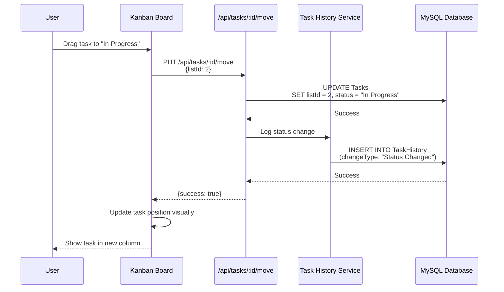

---

## Task Comment Flow

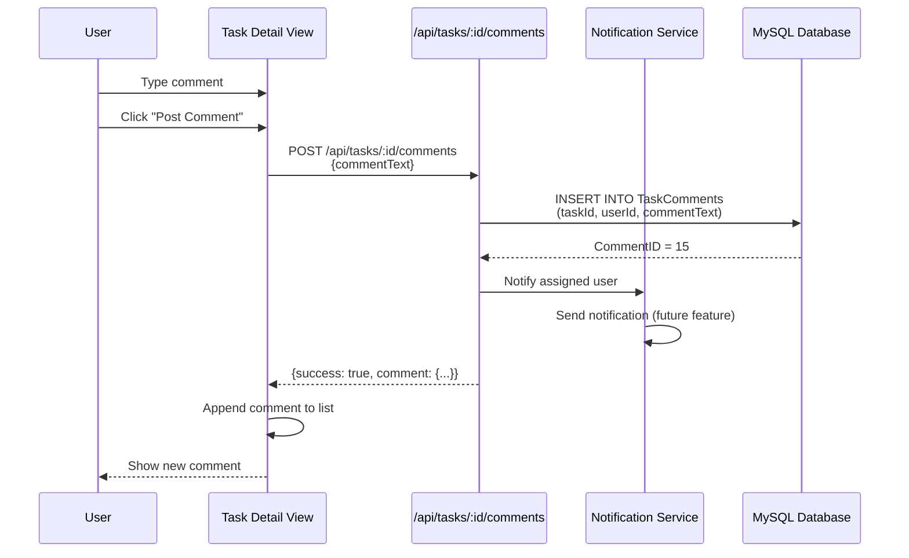

---

## Search Tasks Flow

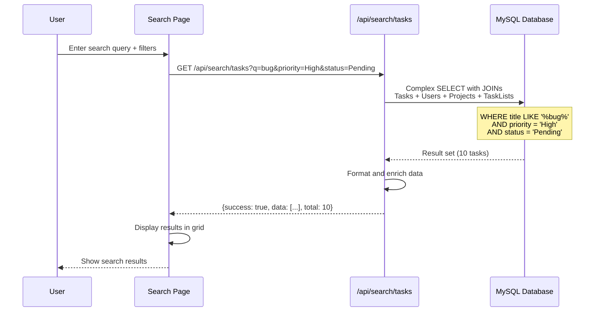

---

## Dashboard Statistics Flow

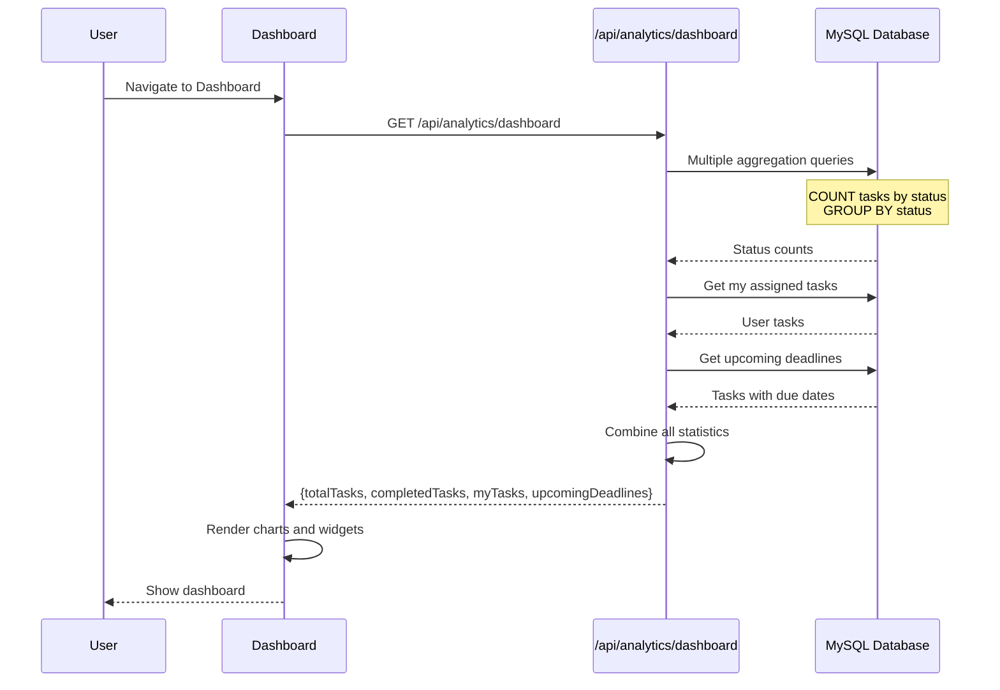

---

## Complete Request-Response Cycle

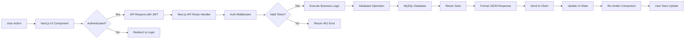

---

## Database Query Flow: Get Project with Tasks

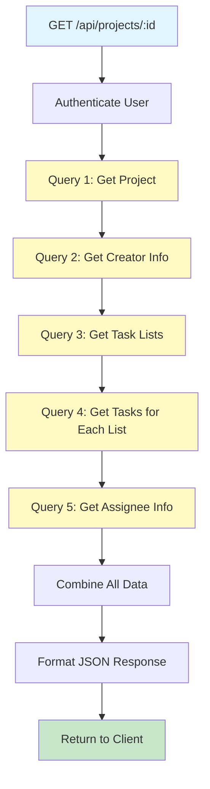

**Optimized Alternative (Using JOINs):**
```sql
SELECT 
    p.*,
    u.UserName as CreatorName,
    tl.ListID,
    tl.ListName,
    COUNT(t.TaskID) as TaskCount
FROM Projects p
LEFT JOIN Users u ON p.CreatedBy = u.UserID
LEFT JOIN TaskLists tl ON p.ProjectID = tl.ProjectID
LEFT JOIN Tasks t ON tl.ListID = t.ListID
WHERE p.ProjectID = ?
GROUP BY p.ProjectID, tl.ListID
```

---

## Error Handling Flow

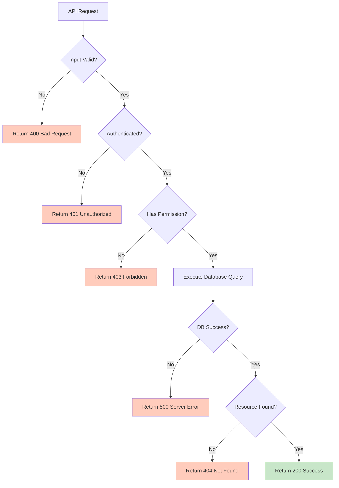

---

## Data Flow Layers

### Layer 1: Presentation (Client)
- **Technology**: React/Next.js Components
- **Responsibility**: Display UI, handle user input, make API calls
- **Data Format**: JSON (received from API)

### Layer 2: API (Server)
- **Technology**: Next.js API Routes
- **Responsibility**: Request validation, authentication, business logic, database operations
- **Data Format**: JSON (send/receive)

### Layer 3: Database (Persistence)
- **Technology**: MySQL
- **Responsibility**: Data storage, enforce constraints, execute queries
- **Data Format**: Relational tables

---

## Key Data Transformations

### 1. Client to Server
```javascript
// Client sends
const taskData = {
  title: "Fix bug",
  priority: "High",
  dueDate: "2025-01-15"
};

fetch('/api/tasks', {
  method: 'POST',
  body: JSON.stringify(taskData)
});
```

### 2. Server to Database
```javascript
// Server transforms and inserts
const query = `
  INSERT INTO Tasks (Title, Priority, DueDate, ListID, AssignedTo, Status, CreatedAt)
  VALUES (?, ?, ?, ?, ?, 'Pending', NOW())
`;
await db.query(query, [taskData.title, taskData.priority, taskData.dueDate, listId, userId]);
```

### 3. Database to Server
```javascript
// Database returns raw data
[{
  TaskID: 1,
  Title: "Fix bug",
  Priority: "High",
  DueDate: "2025-01-15T00:00:00Z"
}]
```

### 4. Server to Client
```javascript
// Server formats response
{
  success: true,
  data: {
    taskId: 1,
    title: "Fix bug",
    priority: "High",
    dueDate: "2025-01-15",
    createdAt: "2025-01-01T10:00:00Z"
  }
}
```

---

## Middleware Chain

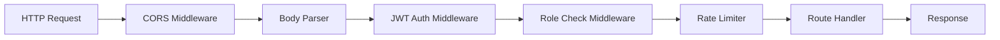

---

## Optimized Query Strategies

### Strategy 1: Eager Loading (JOINs)
- Use for related data that's always needed
- Example: Get task with assignee info

### Strategy 2: Lazy Loading (Separate Queries)
- Use for optional/conditional data
- Example: Load comments only when task detail is opened

### Strategy 3: Pagination
- Use for large result sets
- Example: Task list with 100+ tasks

### Strategy 4: Caching
- Use for frequently accessed, rarely changed data
- Example: User roles, project lists

---

## Real-Time Data Flow (Future Enhancement)

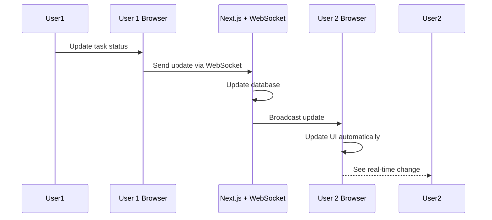

---

## Summary

### Key Data Flows
1. **Authentication**: User credentials → JWT token
2. **CRUD Operations**: User action → API → Database → Response
3. **Search/Filter**: Query params → Complex SQL → Formatted results
4. **Analytics**: Multiple queries → Aggregation → Statistics
5. **History Tracking**: Any task change → Automatic history entry

### Performance Considerations
- Use database indexes for frequently queried fields
- Implement pagination for large datasets
- Join tables efficiently to minimize round trips
- Cache static/rarely-changing data
- Use connection pooling for database

### Security in Data Flow
- All requests pass through JWT authentication
- Role-based access control at API level
- SQL injection prevention via parameterized queries
- Input validation before database operations
- Password hashing (bcrypt) before storage
